📌 E-Commerce System

🚀 Overview

This project is a full-featured E-Commerce system built using Laravel, designed with scalability, maintainability, and clean architecture principles.

It provides a complete solution for managing products, authentication, shopping cart, wishlist, and order processing through RESTful APIs and a dynamic user interface.

The system leverages Laravel Jetstream for authentication scaffolding, combined with Livewire to build reactive UI components. For API security, Laravel Sanctum is used to handle token-based authentication for protected routes.

To ensure clean and maintainable code, Form Request classes are used for validation, while API Resources provide structured and consistent API responses.

## ✨ Highlights (Why this project stands out)

🔐 Secure Authentication using Jetstream + Sanctum (Token-Based)
🧱 Clean Architecture with separation of concerns (Controllers, Requests, Resources)
🔗 RESTful API Design with structured responses using API Resources
⚡ Dynamic UI built with Livewire (no heavy JS frameworks)
🛡️ Robust Validation using Form Request classes
🌍 Localization دعم تعدد اللغات
♻️ Reusable & Maintainable Code Structure

## 🧩 Core Modules

🛍️ Product Management (CRUD)
🛒 Shopping Cart System
❤️ Wishlist Feature
📦 Order Management System
🔐 Authentication & Authorization
🔗 API Endpoints (Sanctum Protected)

## 🛠️ Tech Stack

Layer	Technology
Backend	Laravel (MVC)
Frontend	Livewire
Auth	Jetstream + Sanctum
Database	MySQL
API	RESTful

## ▶️ How to Run

1. Clone the repository
2. Import the database file into MySQL
3. Update database connection in config file
4. Run npm install
5. Run project using XAMPP or any local server
6. Run the project php artisan serve and npm run dev

### 📬 API (Postman)

🔐 Auth
POST /api/auth/register
POST /api/auth/login
POST /api/auth/logout
🔑 Headers
Authorization: Bearer YOUR_TOKEN

## 📸 Screenshots

## 🔐 API (Postman)
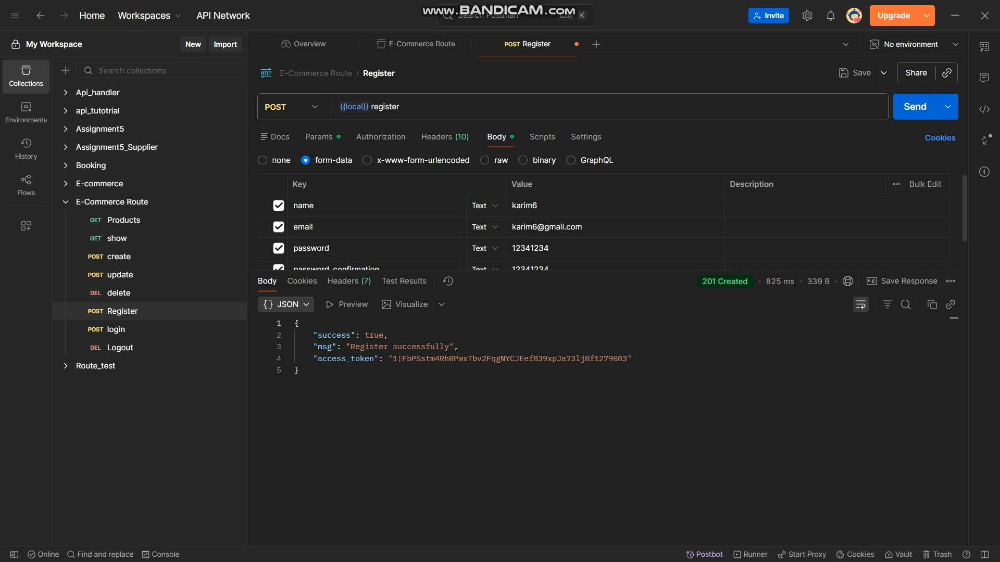
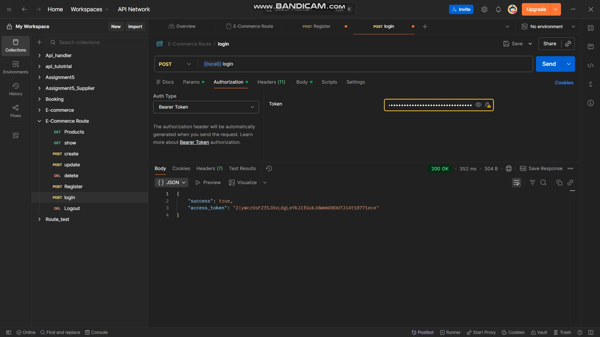
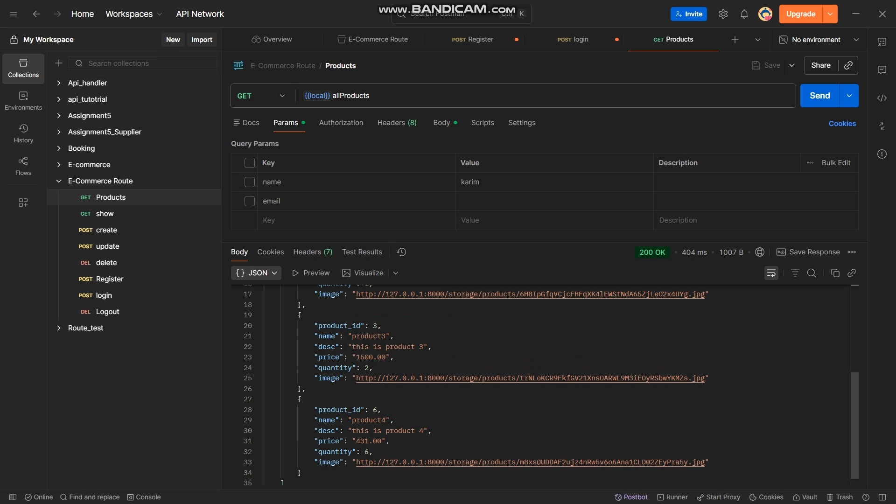
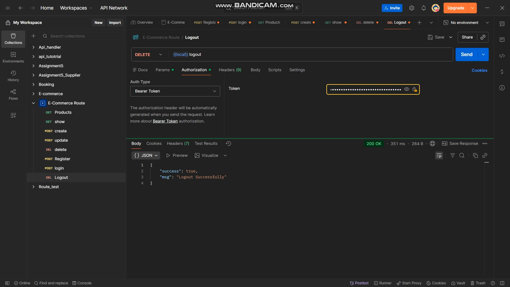

### ➕ Add Product
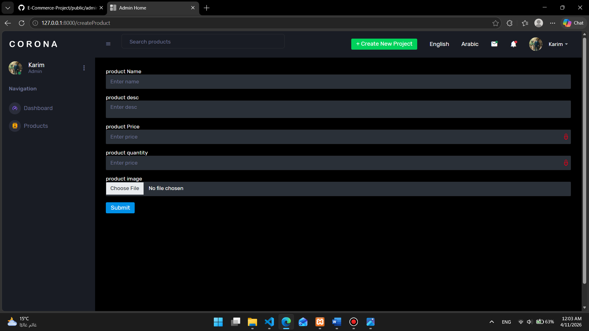

### ✏️ Update Product
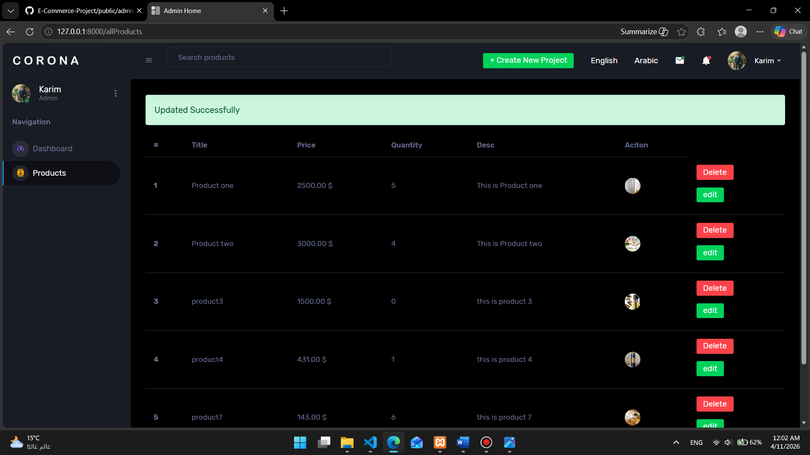

### ❌ Error Message
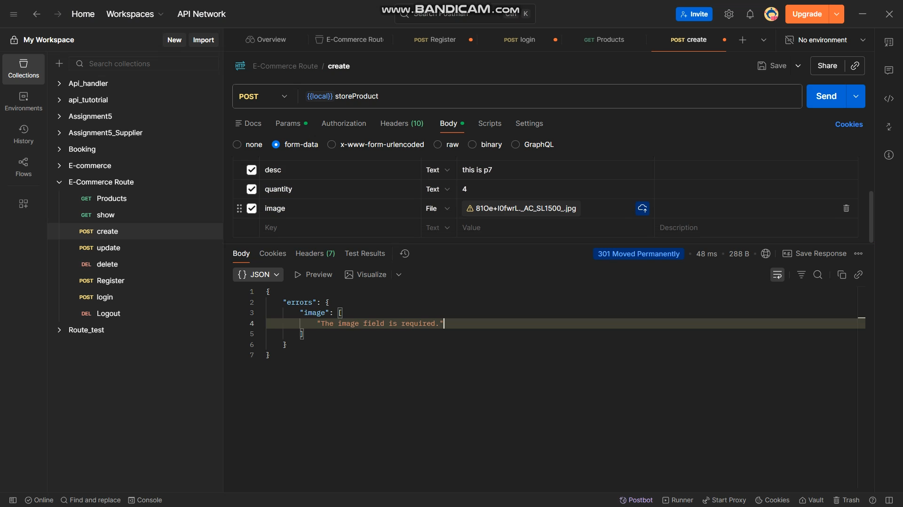
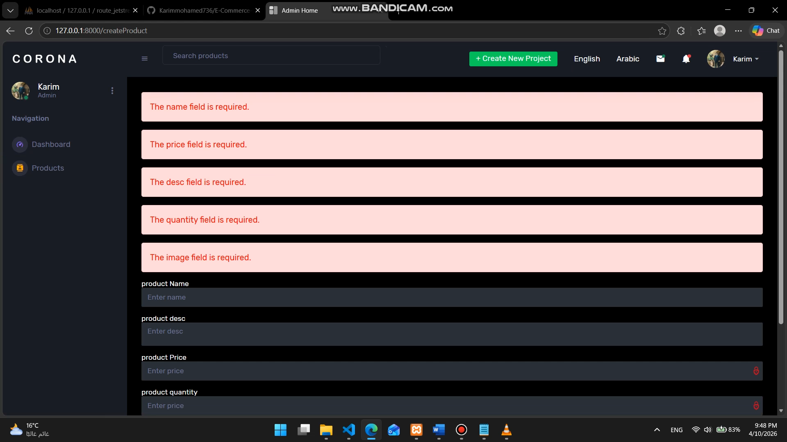
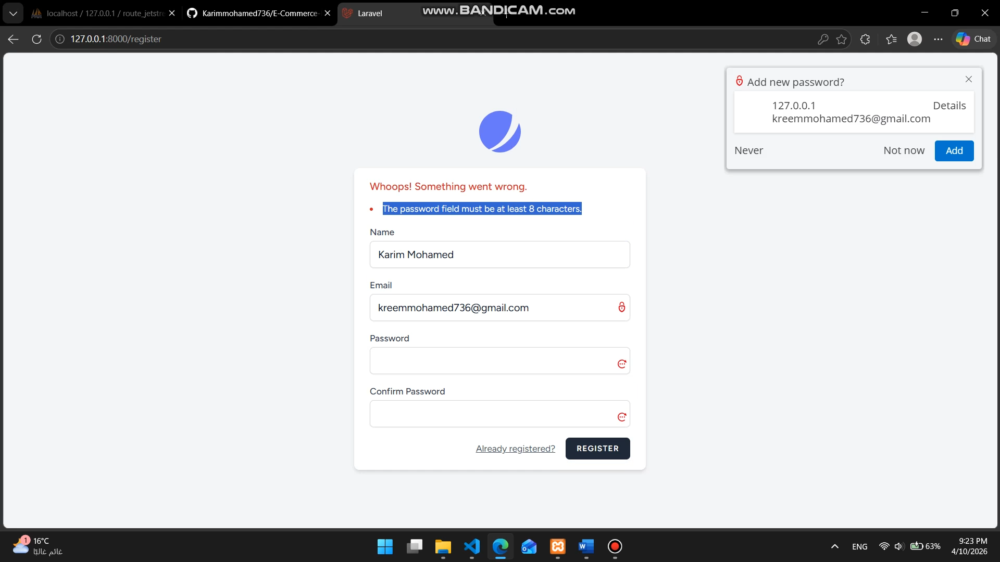

### 👤 User Dashboard
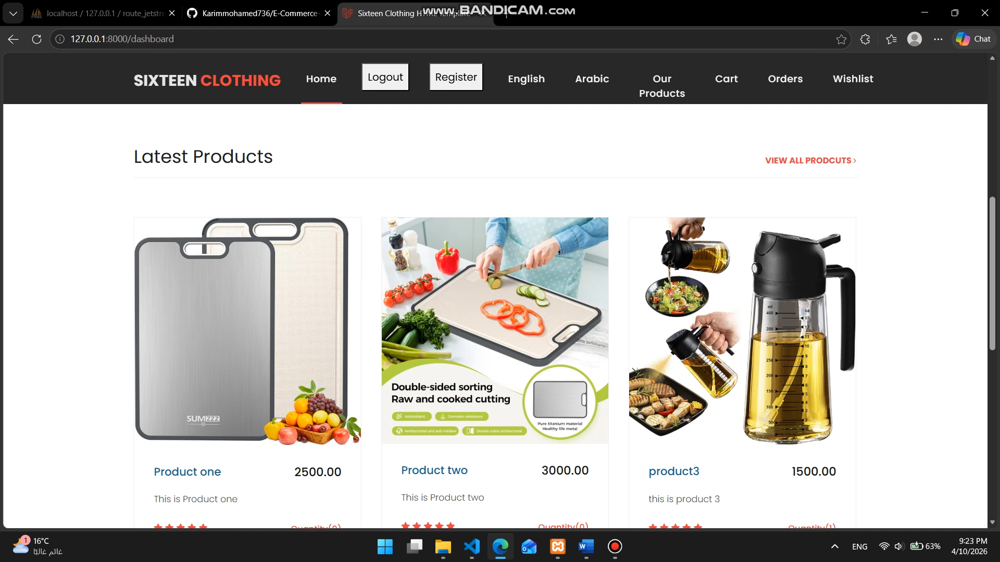

### 🛠️ Admin Dashboard
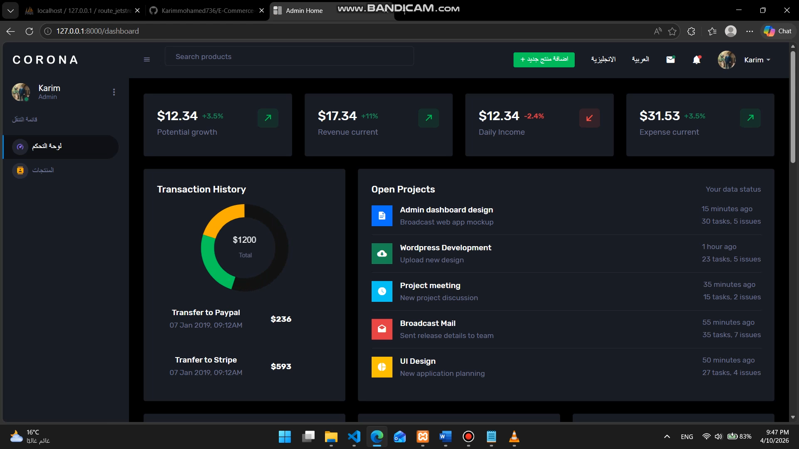

### 🛒 Shopping Cart
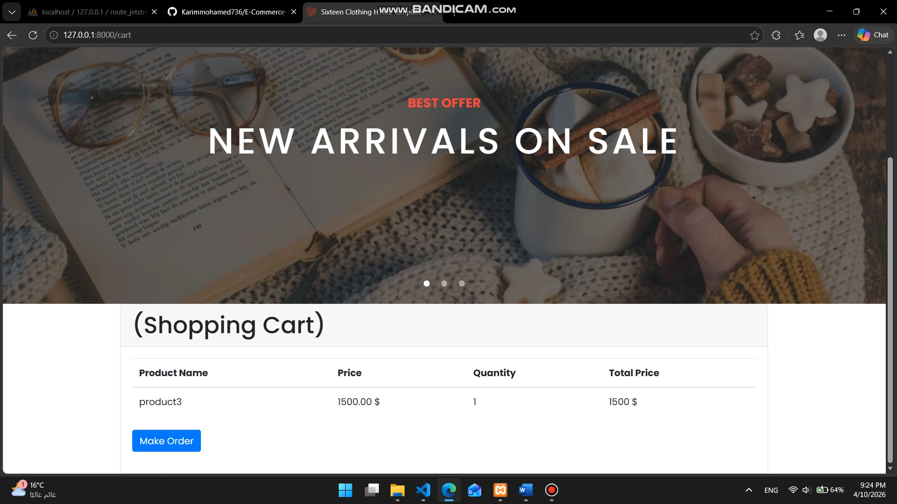
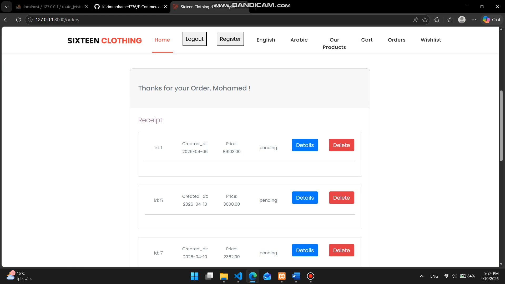
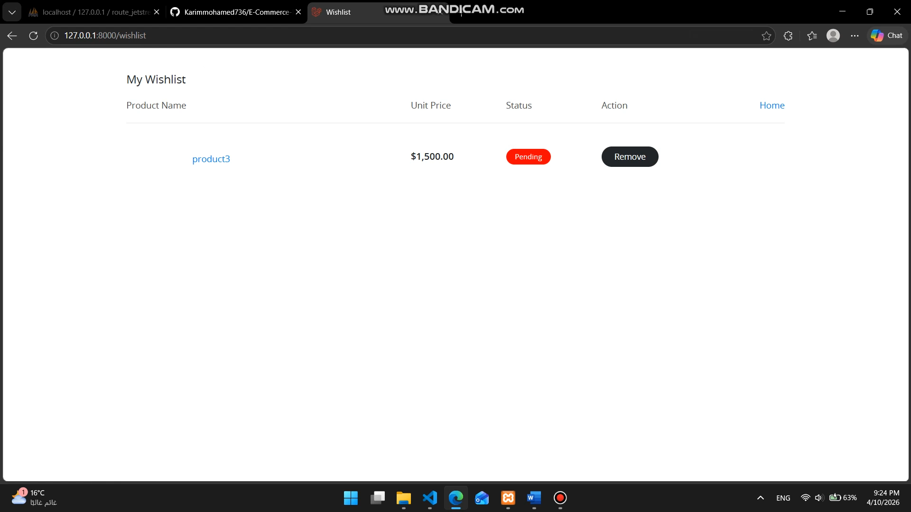

### 🌍 Multi-language Support (Localization)
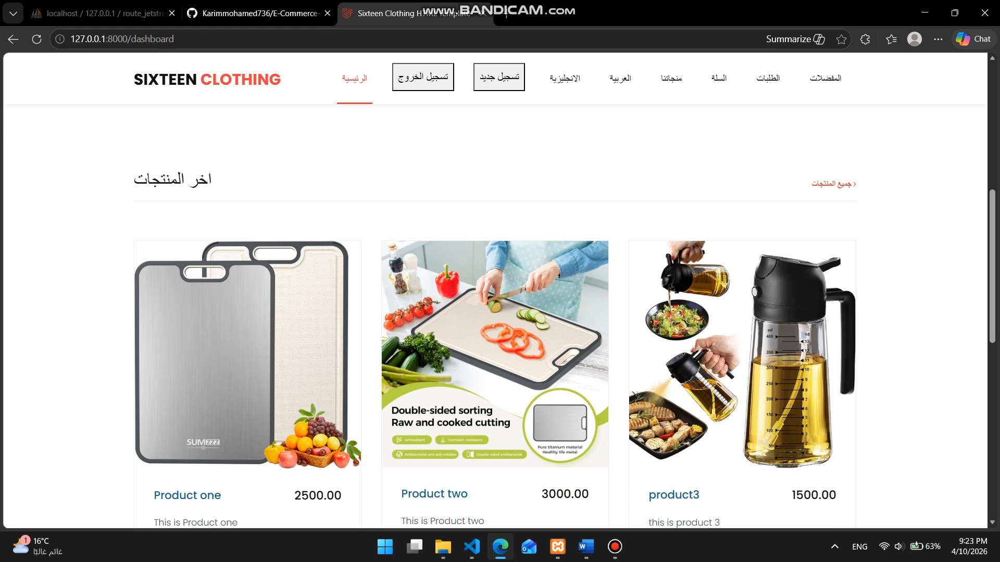

## 🧠 What I Learned

Designing scalable backend systems
Building secure APIs باستخدام Token Authentication
Structuring Laravel projects using best practices
Working with real-world features (Cart, Orders, Wishlist)
Improving code quality باستخدام Requests & Resources

## 👨‍💻 Author

Karim Mohamed

## ⭐ Final Note

This project reflects my ability to build real-world Laravel applications with clean, maintainable code and modern development practices.
